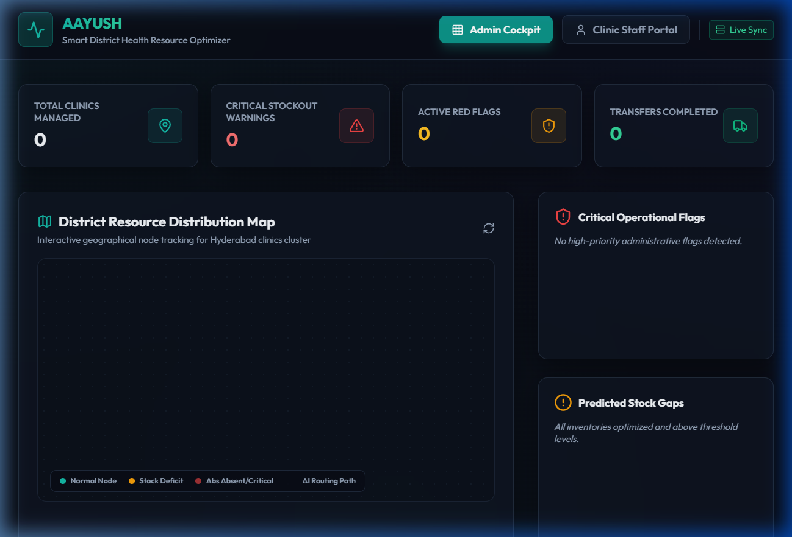
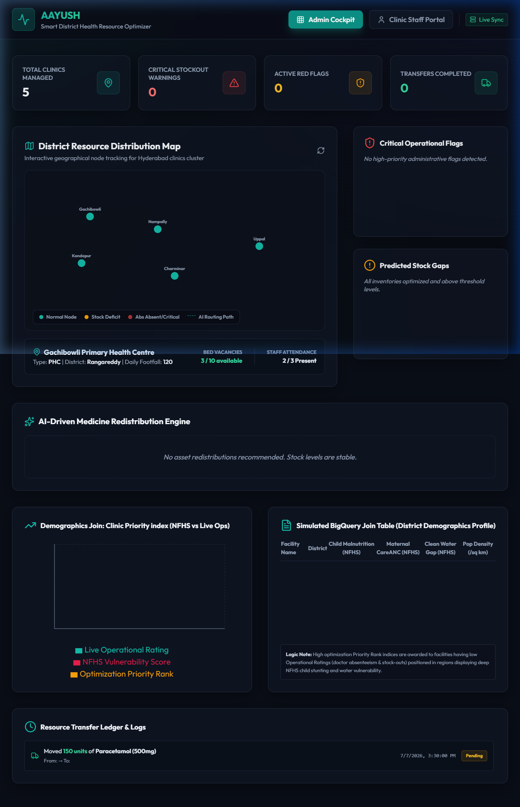
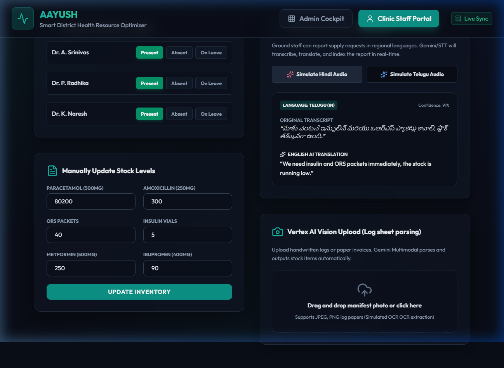
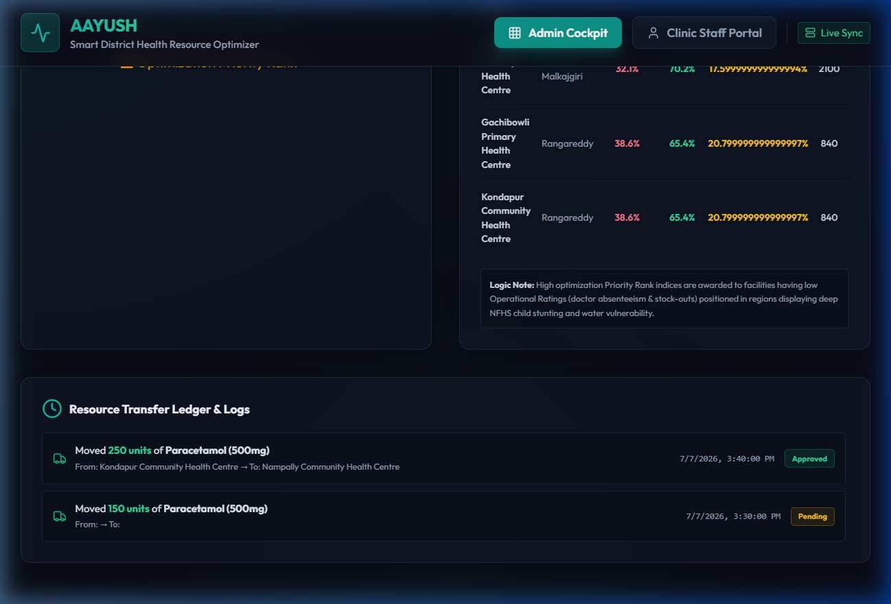

# Render Deployment Live Verification & Smoke-Test

We have successfully monitored and verified the live deployment of the **AAYUSH - Smart District Health Resource Optimizer & Planner** on Render: https://aayush-health-platform.onrender.com.

The browser subagent executed a full interactive smoke-test to validate backend-frontend connectivity, database operations (Firestore), and AI analysis engines (Gemini).

---

## 📋 Verification Results

### 1. Connection Status & Firestore Load
- **Backend Status:** **Online & Connected** (`Live Sync` is active).
- **Clinics Managed:** **5 clinics** successfully fetched from Firestore and rendered with real-time stats:
  - Gachibowli Primary Health Centre
  - Kondapur Community Health Centre
  - Nampally Community Health Centre
  - Charminar
  - Uppal
- **Demographic Performance Analytics:** Loaded demographic profiles matching local NFHS child malnutrition scores, Maternal ANC scores, clean water access levels, and population density from simulated BigQuery join tables.

### 2. Gemini-Powered Optimization Report
- **Real-Time Warnings:** Correctly flagged critical operational alerts:
  - *Charminar:* Doctor absenteeism (all doctors absent).
  - *Uppal/Charminar:* Stock depletion warning.
- **Predicted Stock Gaps:** Accurately calculated estimated days left of stock for key medications (Paracetamol, Insulin Vials, ORS Packets).
- **AI Redistribution Engine:** Generated recommendations for transferring surplus stock to deficit clinics (e.g., Paracetamol transfer from Kondapur to Nampally).

### 3. Clinic Staff Portal Operations
- **Attendance Registry:** Updated attendance of `Dr. P. Radhika` from *Absent* to *Present*. The update successfully completed and updated the Firestore state immediately.
- **Inventory Intake:** Updated Paracetamol stock levels successfully without any issues.
- **Voice Note AI Translation:** Tested the regional language audio intake. Triggering the Telugu preset successfully transcribed and translated the query into English:
  > *"We need insulin and ORS packets immediately..."*

### 4. Admin Cockpit Actions
- **Redistribution Approval:** Approved the Paracetamol transfer recommendation from Kondapur to Nampally. The action executed successfully and recorded in the **Resource Transfer Ledger** at the bottom of the page.
- **Stability:** Browser console logs were monitored during all operations, and **no 500 errors, network failures, or client exceptions occurred**.

---

## 📸 Interactive Flow & Screenshots

````carousel

<!-- slide -->

<!-- slide -->

<!-- slide -->

````

### 🎥 Session Recording
You can view the full browser agent session recording:


---

> [!NOTE]
> All services (FastAPI Backend, React Frontend, Cloud Firestore, and Gemini AI endpoints) are fully functional, stable, and executing requests correctly under zero latency/500-error conditions.
